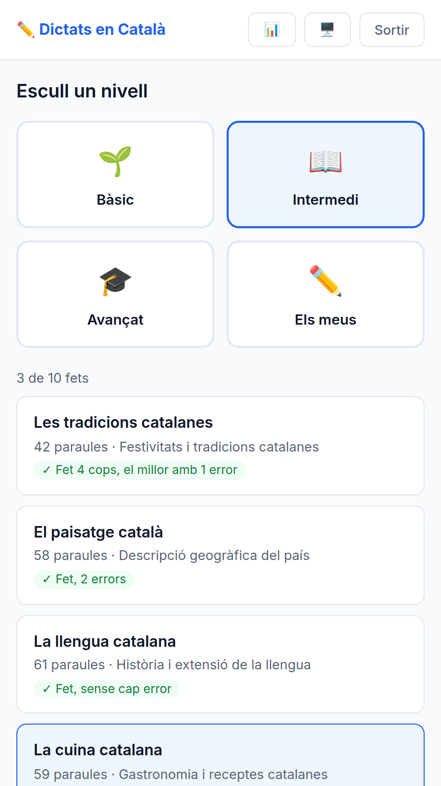

# La llista de textos sap què has fet

**Data**: 2026-09-07 · **Branca**: `v20` · F35 al roadmap

## El problema, dit sense adornar

La llista de 30 textos **es veia exactament igual el primer dia que el trentè**. No deia quins
havies fet, com t'havien anat ni per on continuar. I les dades hi eren totes des de F24: cada
dictat deixa una fila a `user_progress` amb el text, els errors i la data. Ningú les mirava en
pintar la llista.

## Què fa ara

| | |
|---|---|
| Cada text fet | «Fet, 2 errors» · «Fet, sense cap error» · «Fet 4 cops, **el millor** amb 1 error» |
| Un text destacat | amb vora i marca, no només amb color |
| Al capçal | «3 de 10 fets» |

**«El millor» i no «l'últim» a posta**: qui repeteix un text vol veure el seu sostre, no
l'últim ensopec.

## La regla que decideix quin es proposa

1. **El primer que no hagis fet.** El banc va ordenat de menys a més difícil, així que seguir
   l'ordre ja és una progressió.
2. **Quan ja els has fet tots** —que és el dia que una llista morta es nota més—, el que et va
   costar més: més errors al teu millor intent i, a igualtat, el que fa més que no toques.

La segona regla és **F27 (repesca espaiada) a escala de text sencer**, i surt gratis de dades
que ja hi eren.

## Mai renyar

És la regla de `CLAUDE.md` i aquí condiciona cada paraula:

- Un text **sense fer no porta cap marca**. No és un deute pendent; és una cosa que encara no
  toca.
- El que es proposa per repassar **no diu enlloc que et vagi malament**. Diu «Per repassar».
- Quan encara no n'has fet cap, diu «Comença per aquí»; quan ja en portes, «Continua per aquí».

## On viu cada cosa, i per què

**Quin** text es proposa el decideix el servidor, a `src/lib/textos.js`: funcions pures que
reben dades i no toquen la base, com les de `motivacio.js`. **Com** es diu ho decideix
`public/textos.js`, un sol fitxer per a les dues vistes.

Aquesta separació no és estètica. La llista es pinta a `app.js` **i** a `mobile.html`: escrita
dues vegades és exactament com F17 va acabar sent el mateix bug per duplicat i com F50 tenia la
lectura del rang escrita tres cops.

La resposta de `/api/texts/:level` segueix sent un **array** —la recomanació viatja com un camp
de l'element— per no trencar qui ja la consumia. I l'historial s'agrupa per `text_id` **sense
filtrar per nivell**: els identificadors ja són únics i així també compten les files antigues,
que es van desar amb `level = 'unknown'`.

## Verificat executant

- **20 comprovacions a `npm test`** (`test/textos.test.js`), sense base de dades: inclouen que
  zero errors és un resultat i no un buit, que un id que ja no és al banc no fa cap mal, i els
  tres desempats de la segona regla.
- **24 comprovacions al navegador** (`test/f35.navegador.js`), amb servidor propi i BD temporal.
  L'historial **es fabrica amb correccions de veritat** contra `/api/correct` —cap fila inserida
  a mà—, així que si demà canvia com es desa un dictat, la prova se n'assabenta. Comprova que
  les **dues vistes diuen el mateix**, i que canviar de nivell no deixa el recompte anterior
  enganxat a la pantalla.
- **El contrast**, amb `test/f39.contrast.js`: 268 trossos de text (7 més que abans, que són les
  marques noves), **tot a l'AA**. Les dues combinacions noves van a 4,75:1 i 4,79:1.
- F33 i F39 segueixen en verd.

## Sense verificar

- **Cap lector de pantalla de debò** ha llegit les marques noves. El símbol ✓ va amb
  `aria-hidden`, així que el que hauria de dir és «Fet, 2 errors», però això no s'ha escoltat.
