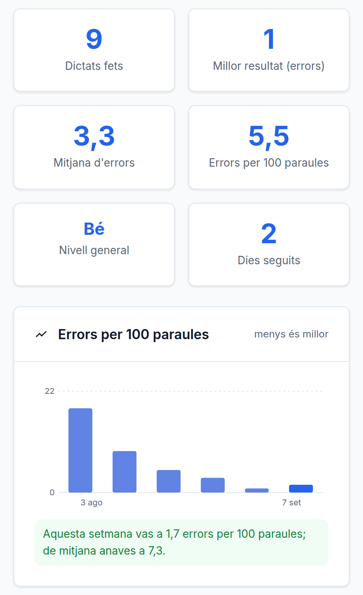

# El progrés es pot comparar amb un mateix

**Data**: 2026-09-07 · **Branca**: `v21` · F36 al roadmap

## Dues coses que feien que la xifra del perfil no volgués dir res

**1. La mitjana anava arrodonida a enter.** 2,4 i 2,6 es veien igual. Justament el nombre que
havia d'ensenyar la millora era el que la esborrava.

**2. Es comparaven dictats de 34 paraules amb altres de 84.** Tres errors en un text bàsic i
tres en un d'avançat sortien com el mateix resultat, i no ho són:

```
3 errors en 34 paraules  ->  8,8 per 100
3 errors en 84 paraules  ->  3,6 per 100
```

## Què hi ha ara



La unitat és **errors per 100 paraules**, la mitjana porta un decimal, i hi ha una **corba per
setmanes**. El gràfic és SVG escrit a mà: aquesta app no té pas de compilació i això són barres
i quatre línies; una llibreria de 300 kB seria pitjor que el problema.

La taxa **pesa per paraules, no per dictats**: no és la mitjana de les taxes de cada dictat,
sinó els errors totals sobre les paraules totals. Amb dictats de mides diferents no és el
mateix nombre.

## El que NO canvia, i és una decisió de producte

**L'escala motivadora segueix anant per nombre d'errors.** «Molt bé!» vol dir «dos errors», no
«dos i mig per cada cent paraules». Ho fixa `CLAUDE.md` i es llegeixen en llocs diferents,
igual que el rang i l'escala.

## Els dictats vells no s'estimen

`rang.js` sí que estima les paraules dels dictats anteriors a F45, per no deixar sense punts
l'historial de qui ja feia servir l'app. **Aquí no.** El preu d'equivocar-se allà són uns punts;
aquí és ensenyar una millora que no ha passat. Queden fora de la taxa, segueixen comptant com a
dictats fets, i **es diu quants són**.

## La tendència només parla quan ha anat a millor

És la mateixa regla que F66 i ve de «mai renyar». Si la setmana ha anat a pitjor **la corba ho
ensenya igual** —no s'amaga cap dada—, però l'app no hi posa paraules a sobre.

## Accessible, i mesurat

L'SVG va amb `aria-hidden` i al costat hi ha **la mateixa informació en una taula** que només
llegeix el lector. Un `aria-label` amb un resum no serveix: qui no hi veu té dret als nombres,
no a un resum que hàgim triat nosaltres.

**I mesurar va destapar dues coses que no es veuen llegint el codi:**

1. **Les barres estaven a 2,16:1.** Una barra d'un gràfic és contingut no textual que transmet
   informació, i la WCAG 1.4.11 li demana 3:1. A opacitat 0,45 no hi arribaven. Ara van a 0,7 →
   **3,57:1**. El guionet de setmana buida anava a `--border`, **1,23:1**, pràcticament
   invisible; ara va a `--text-muted`, 5,83:1.
2. **`f39.contrast.js` no sabia mesurar text dins d'un SVG.** Llegia `color` quan allà el color
   del text és `fill`, així que mesurava un color heretat que no es pinta enlloc. Corregit: les
   etiquetes dels eixos ara hi entren.

## Verificat executant

- **33 comprovacions a `npm test`** (`test/progres.test.js`), sense base de dades: que 2,4 i 2,6
  ja no es veuen igual, que la taxa pesa per paraules, que els forats de setmanes buides no
  s'amaguen i que no es fabrica passat anterior al primer dictat.
- **22 comprovacions al navegador** (`test/f36.navegador.js`), amb servidor propi i BD temporal.
  Els dictats són **correccions de veritat**; l'única cosa que es toca a mà és el `completed_at`
  d'aquelles mateixes files, per escampar-les per setmanes — no hi ha manera de fer un dictat
  «la setmana passada» per l'API.
- **El contrast**: 358 trossos de text, tot a l'AA.
- F33, F35 i F39 segueixen en verd.

## Sense verificar

- **Cap lector de pantalla de debò** ha llegit la taula del gràfic.
- **La resta d'elements gràfics que no són text** —vores de camps, la barra del rang— segueix
  sense mesurar. Les barres d'aquest gràfic estan mesurades a mà, no per l'eina.
- **F48**, la corba del rang en el temps, segueix pendent: això mesura errors, no punts.
