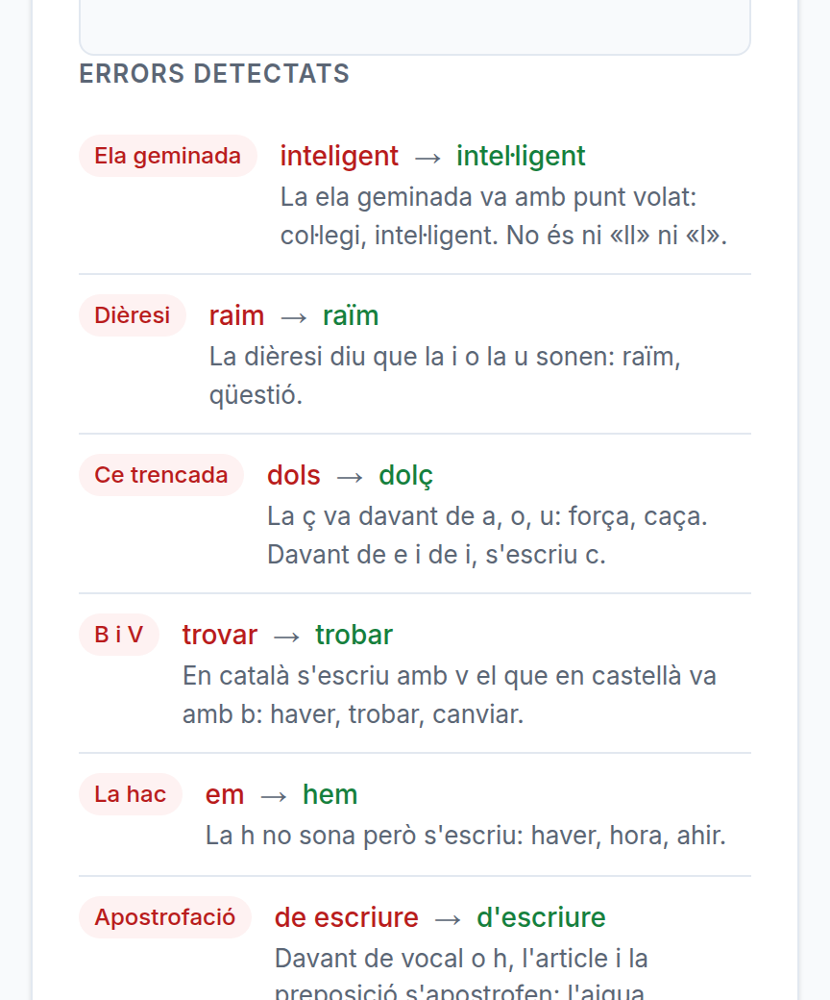

# Cada error sap de quina regla és

**Data**: 2026-09-07 · **Branca**: `v22` · F25 al roadmap

## El problema: sis tipus que descriuen una diferència, no una regla

`ortografia` s'emportava la ela geminada, la ce trencada i la b/v **totes tres juntes**.
`accentuació` s'emportava els diacrítics i la dièresi. Amb això l'app no podia dir mai
«se t'escapa la ela geminada», que és exactament el que vol saber qui practica —i el que
un docent li diria.

I sense categories que siguin regles no es poden fer **F26** («on falles»), **F27** (repesca
de les frases fallades) ni **F28** (micro-exercicis del teu propi error): les tres necessiten
agrupar per regla.

## Vint categories, cadascuna amb la seva regla escrita



Apostrofació · pronoms febles · diacrítics · obert/tancat · dièresi · accentuació · ela
geminada · b/v · ç · essa sorda i sonora · h · guionets · concordança · per/per a ·
majúscules · puntuació · ortografia · paraula incorrecta · omesa · afegida.

La captura és **sense cap clau d'API**: el text que explica cada error surt del catàleg, no
del model. Quan el model respon, l'afina; quan no, això ja s'aguanta sol.

## Es classifica amb un algorisme, no amb el model

La mateixa raó que F31, i tres conseqüències concretes:

1. La correcció **no depèn de que l'API respongui**.
2. La categoria és **reproduïble**: la mateixa parella de paraules dona sempre la mateixa.
3. **L'historial vell es pot tornar a classificar.** I s'ha fet: la migració de `db.js`
   recalcula el `type` de les files que ja hi havia. Sense això, F26 diria «14 errors
   d'ortografia» de tot el passat, que és precisament la resposta que no serveix.

La columna `taxonomia` és el número de versió del catàleg, així que passar-hi dues vegades
no fa res.

## Els diacrítics són els de la norma vigent

Els quinze de la reforma del 2016. **`dóna`, `sóc`, `nét` i `ós` ja no en porten**, i
posar-los a la llista seria ensenyar una ortografia que fa deu anys que no existeix. El banc
de textos, comprovat, no en té cap.

## El que NO es detecta, dit clar

- **Concordança de nom i adjectiu** («les cases blanca»). Distingir-la d'una errada de
  conjugació demana gramàtica, no comparar lletres. Aquí només es diu «concordança» quan les
  dues paraules són **determinants de la mateixa família** —`les`/`els`, `aquesta`/`aquest`—,
  que sí que és inequívoc. `el`/`un` no ho és: és triar un altre determinant.
- **`l'` davant de verb** és el pronom feble «el» («l'he vist»), no l'article. Compta com a
  apostrofació; separar-ho vol saber si el que ve després és un verb.
- **`per`/`per a` quan l'alumne AFEGEIX l'`a`** només es veu si al seu text hi ha més «per a»
  que a l'original: el diff no guarda l'índex de les paraules de més.

## Un bug d'alineació que això ha destapat

Buscant el cas de `per a`, va sortir que **«per a estudiar català» escrit «per estudiar
catala» deia que l'alumne havia escrit "catala" en comptes d'"a" i que s'havia deixat
"català"**: dos errors inventats en lloc dels dos de veritat.

La causa és anterior a aquesta feina i està comprovada contra el codi d'abans: la finestra de
veïnatge de `ajuntaApostrofs` (±2 posicions) ajuntava trams sense cap relació i els tornava a
aparellar per ordre. Ara **una tanda sense cap apòstrof no es toca**, que és el que la funció
volia dir des del principi.

## Verificat executant

**El banc de proves**, que injecta errors de classe coneguda (`npm run benchmark`):

```
diacritic       158/158  100%   diacrítics (158)
ela-geminada     22/22   100%   ela geminada (22)
apostrofacio    155/155  100%   apostrofació (155)
pronoms-febles   37/37   100%   pronoms febles (37)
dieresi          23/23   100%   dièresi (23)
ce-trencada      43/43   100%   ç (43)
b-v              40/40   100%   b/v (40)
accent-general  372/372  100%   accentuació (327), diacrítics (39), dièresi (6)
TOTAL           850/850  100%   ·  falsos positius: 0
```

**Recall del 100 % i cap fals positiu** — n'hi havia quatre, i han caigut amb l'arreglo de
l'alineació. Set de les vuit classes van ja a una categoria pròpia; la vuitena es reparteix
perquè l'etiqueta del banc agafa **qualsevol** paraula accentuada, `món` i `raïm` inclosos:
el classificador és més precís que la classe amb què s'han injectat.

A més: **56 comprovacions a `npm test`** (`test/taxonomia.test.js`) i les cinc expectatives
de `test/diff.test.js` actualitzades — les cinc canviaven a una categoria més precisa.
F33, F35, F36 i F39 segueixen en verd, i el contrast també.

## Sense verificar

- **Cap professor de català ho ha repassat.** Les regles del catàleg estan escrites amb el
  que sé, i són el text que llegirà qui practica.
- **La precisió fora del banc**: el banc injecta errors d'una classe cada vegada. Una paraula
  amb dos errors alhora (`col·legi` escrit `colejio`) cau a `ortografia`, que és honest però
  no diu res.
