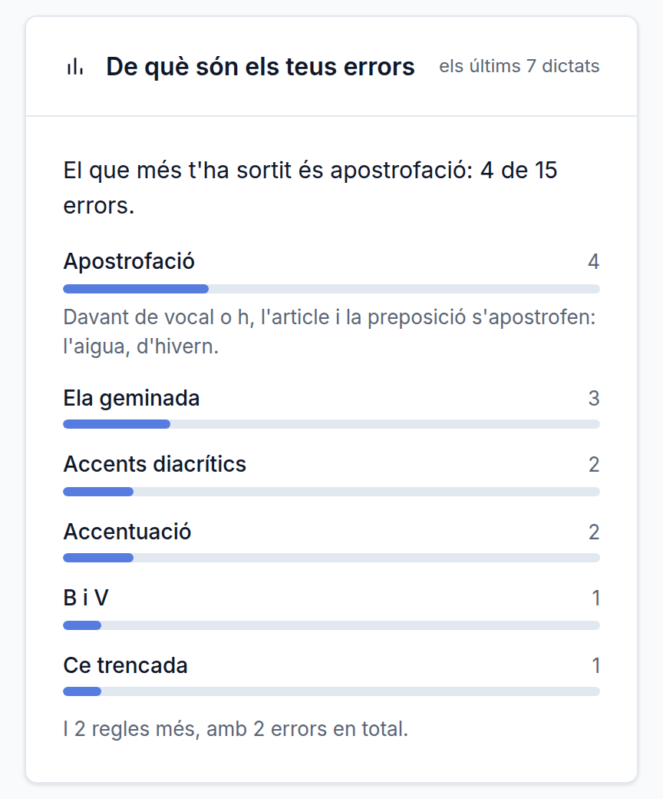

# De què són els teus errors

**Data**: 2026-09-07 · **Branca**: `v24` · F26 al roadmap

## La pregunta que faltava

Quants errors has fet ja ho diuen l'escala de cada dictat i la mitjana del perfil. La
pregunta de qui vol millorar és **de què**. Fins avui no es podia contestar, i no per falta
de dades —es desen des de F24— sinó perquè els sis tipus d'abans deien `ortografia` a la ela
geminada, la ce trencada i la b/v alhora. **«Ortografia» no és cap regla que es pugui
estudiar.**

Amb la taxonomia de F25 al lloc, això és ajuntar el que ja hi havia.

## Quatre decisions que canvien el que es veu

**Els avisos no hi entren.** Quan la puntuació no s'ha dictat, els seus errors es desen amb
`counted = 0` perquè no es pot penalitzar el que no s'ha pogut sentir. Comptar-los aquí
ensenyaria un forat que no és de qui escriu.

**Es mira una finestra, no tot l'historial.** Els últims 20 dictats. El que et sortia fa tres
mesos no és el que has d'estudiar avui, i barrejar-ho amaga precisament la millora.

**La regla només s'ensenya de la primera.** Amb totes, la targeta passaria a ser un llibre de
gramàtica i no se'n llegiria cap.

**El titular calla quan no hi ha res a dir**: amb menys de quatre errors, o si les dues
primeres regles empaten. «El 50 % són d'apostrofació» sobre dos errors és una xifra que no
vol dir res i que espantaria per no res. I es mostren sis regles: la cua de regles amb un sol
error és soroll, i es resumeix en una línia.

Tot plegat és la regla de `CLAUDE.md`: **mai renyar**. Això diu «el que més t'ha sortit» i
dona la regla per estudiar-la. No diu enlloc que ho facis malament.

## El contrast, mesurat i amb una excepció declarada

La part plena de la barra fa **3,18:1** contra el carril, per sobre del 3:1 que la WCAG
1.4.11 demana als gràfics que informen.

**El carril no hi arriba**: 1,23:1 contra la targeta. És a posta i està escrit al CSS, perquè
**el nombre sempre s'escriu al costat**: la barra ajuda a llegir la proporció d'un cop
d'ull, no és l'única manera de saber-la. El dia que el nombre desaparegui, això s'ha de
refer.

## Verificat executant

- **20 comprovacions a `npm test`** (`test/onfalles.test.js`), sense base de dades: l'ordre,
  els percentatges, l'empat trencat pel nom perquè la llista no balli entre dues càrregues, i
  els tres casos en què el titular ha de callar.
- **17 al navegador** (`test/f26.navegador.js`): els dictats són **correccions de veritat**
  amb errors d'una regla concreta injectats a posta, així que es comprova alhora que la
  classificació de F25 arriba fins a la pantalla i que l'agrupació és la bona. També que un
  error de puntuació no dictada **no** apareix, i que amb l'historial buit la targeta no es
  veu.
- El contrast de tot el text del perfil segueix a l'AA.

## Sense verificar

- **Cap lector de pantalla** ha llegit la targeta.
- **Amb dades de veritat no s'ha vist mai**: a producció hi ha dos dictats i cap error desat.
  El que s'ha provat és amb historial fabricat aquí.
