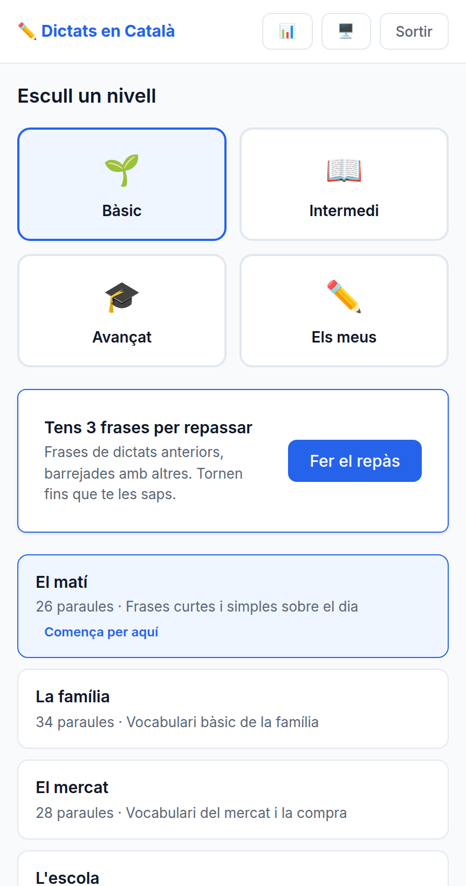

# Les frases que has fallat tornen

**Data**: 2026-09-07 · **Branca**: `v27` · F27 al roadmap

## El que canvia

Fins avui cada dictat era un episodi solt: es corregia, es desava un nombre i **no tornava a
influir en res**. És literalment el que el roadmap diu que l'app ha de deixar de fer.

Una frase on has fet almenys un error que compta torna **l'endemà**. Si la fas bé, torna als
**3 dies**; si també, als **7**; i si també, s'acaba: ja no torna. El que fa funcionar això
no és el nombre exacte de dies, sinó que **creixin cada vegada que encertes**.

## Cinc decisions que val la pena que constin

**Fallar-la la torna a baix de tot**, encara que anés pel tercer intent. Si avui l'has
fallat, no te la saps.

**Barrejades entre altres.** La sessió s'omple amb frases dels mateixos textos que avui no
tocaven, i **el client no sap quines són les de repàs**: el servidor no li ho diu. Si ho
sabés, es podria mirar — i tot el sentit de barrejar-les és que no ho sàpigues. Un repàs on
saps què ve no entrena; pares una atenció que no pararàs mai en un dictat de veritat.

**Els avisos no fan tornar res.** Si la puntuació no s'ha dictat, els seus errors no
compten a l'escala i tampoc han de fer tornar una frase que en realitat has escrit bé.

**El repàs compta com un dictat**, amb `level: repas` i dificultat **1**. Premiar-lo per
sobre del bàsic convidaria a pujar de rang repassant en comptes de fent dictats nous.

**El text de la frase no es desa.** La taula guarda `text_id` + número de frase i el text es
torna a treure del banc. Desar-lo voldria dir que editar un text personal deixaria repassos
apuntant a una frase que ja no existeix.

## Una frase de farciment que falles també entra

No és un cas especial: és la mateixa regla. Si l'has fallat, torna. Això fa que el repàs
s'alimenti d'ell mateix sense cap codi a part.

## Verificat executant

- **29 comprovacions a `npm test`** (`test/repesca.test.js`), sense base de dades: els talls
  de frase, els intervals, què passa en encertar i en fallar, i que la barreja és
  imprevisible però **reproduïble** amb la mateixa llavor.
- **23 d'API** (`test/f27.integracio.js`), amb servidor i BD temporals. Els dictats són
  correccions de veritat; l'única cosa que es toca a mà és `toca_el`, per fer com si
  haguessin passat els dies. Cobreix el cicle sencer: fallar → esperar → encertar → pujar →
  fallar → tornar a baix → tres encerts → desapareix.
- **11 de pantalla** (`test/f27.navegador.js`): que la targeta no hi és fins que toca, que
  diu quantes frases són, que el botó obre el repàs de veritat i que desapareix en acabar.
- El contrast de tot el text segueix a l'AA, i les altres set suites en verd.

## Sense verificar

- **Ningú l'ha fet servir tres dies seguits.** Tot el que es prova aquí mou `toca_el` a mà;
  el comportament amb dies de veritat és el mateix codi, però no s'ha viscut.
- **Quantes frases és massa.** Amb 20 dictats fallats pot haver-hi més pendents dels que
  caben en una sessió de vuit; les que sobren es queden per demà i encara no se sap si això
  és una cua que creix.
