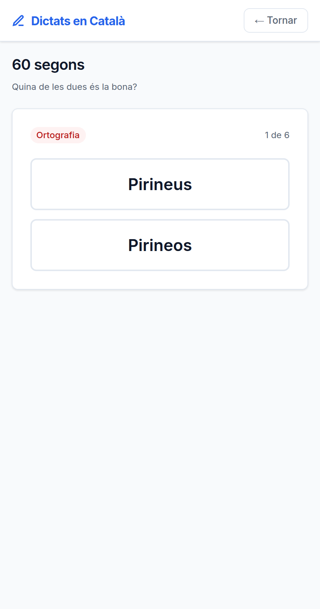

# Seixanta segons

**Data**: 2026-09-07 · **Branca**: `v28` · F28 al roadmap

## El problema, que és de calendari i no de producte

La unitat mínima de l'app era **un dictat sencer**: cinc o deu minuts, auriculars i un lloc
on no molestis. Això vol dir que hi ha dies que no s'entra, i el que no s'entra no es
practica.

A `/micro` hi ha vuit targetes. Dues formes de la mateixa paraula —la que toca i la que vas
escriure— i triar-ne una. Sense àudio i sense escriure: es fa a la cua del súper.

## Surten dels teus errors, i per això no costen res

Des de F24 cada error desa la paraula bona i la que vas posar; des de F25 sap de quina regla
és. **No hi ha res a generar**, així que —com F31, F25 i F26— això funciona **sense cap clau
d'API**.

Una llista d'exercicis genèrics seria una altra app. Això és **el teu** error, tornat a
preguntar.

## Quatre decisions

**Les paraules repetides no fan targetes repetides**, fan una que pesa més. Si has fallat
`és` sis vegades no vols sis targetes iguals seguides: vols que `és` surti abans que una que
has fallat un cop.

**La resposta bona no viatja al client abans de contestar.** Es comprova al servidor contra
la fila, que a més ha de ser teva. Provat: contestar una targeta d'una altra persona no
corregeix res ni suma al teu compte.

**Quina de les dues va a dalt** es decideix amb una llavor del dia. Si la bona sortís sempre
primera s'aprendria la posició, no la paraula.

**El que es desa és una fila per dia, no per targeta.** El detall de cada resposta no diu res
que `user_errors` no sàpiga ja. Això només ha de contestar «quantes n'has fet avui», que és
el dato que li faltava a l'objectiu diari de F34.

## El que va destapar mesurar

La barreja estava escrita **dues vegades** —a `repesca.js` i a `micro.js`—, que és
exactament el que porto tot el dia dient que no s'ha de fer. I a més estava malament: un
generador congruencial lineal té els bits baixos febles, i en una llista de dos elements
`estat % 2` **només depèn de la paritat de la llavor**. Dues llavors senars donaven la
mateixa barreja.

Es va veure escrivint la prova de «canviar la llavor ha de canviar l'ordre»: no el canviava.
Ara viu a `src/lib/atzar.js`, una sola vegada, i pren els bits alts.

## I un error de català meu

El primer text que va sortir a la pantalla deia **«6 targetas»**. El plural de *targeta* és
*targetes*; en català no es fa afegint una s. Arreglat, amb el comentari al costat perquè no
torni.

## Verificat executant

- **27 comprovacions a `npm test`** (`test/micro.test.js`): què pot ser targeta i què no
  —les omissions i la puntuació no—, que les repetides pesen, que la resposta no hi és, i
  que cap dels tres missatges de resultat renya.
- **17 d'API** (`test/f28.integracio.js`): el cicle sencer, que el compte del dia s'acumula
  entre tandes, i que una targeta d'una altra persona no es pot contestar.
- Contrast a l'AA i les altres nou suites en verd.

## Sense verificar

- **Ningú ha fet una tanda de debò.** Els 60 segons són un càlcul —vuit targetes a set
  segons—, no una mesura.
- **No hi ha objectiu diari encara.** Es desa quantes en fas; quin és l'objectiu i com
  s'ensenya és F34.
