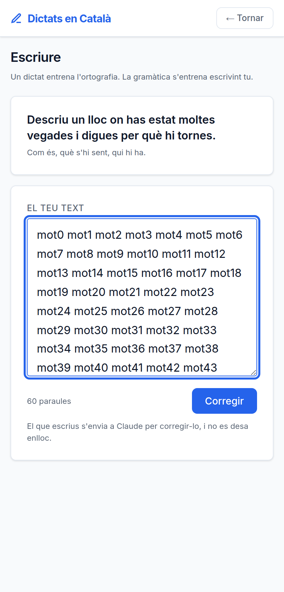

# La gramàtica s'entrena produint

**Data**: 2026-09-07 · **Branca**: `v29` · F29 al roadmap

## El buit que quedava

Un dictat entrena **l'oïda i l'ortografia**: sents una frase i l'escrius bé o malament. La
concordança, els pronoms febles, l'ordre de la frase, els connectors, el `per`/`per a` —tot
això només apareix quan **has de decidir tu** com dir-ho. Copiant no es decideix res.

A `/escriure` tries un dels deu temes, escrius entre 40 i 400 paraules, i el model corregeix
la llengua: el tros, com hauria d'anar, la regla i per què.

## La diferència que ho canvia tot

**Aquí no hi ha text original.** Tota l'app funciona des de F31 sobre una comparació
determinista contra l'original: per això la correcció és exacta, no depèn de l'API i les
categories de F25 es poden calcular. **Res d'això serveix aquí.**

Conseqüència, dita clara: **és l'única part de l'app que no funciona sense clau d'API**. I
quan no n'hi ha, es diu **abans** d'escriure, no després d'haver-hi deixat deu línies:

> Ara mateix no hi ha connexió amb Claude, així que això no es podrà corregir. Els dictats sí
> que funcionen.

## Es llencen les observacions que el model s'inventa

Si el model cita un fragment que **no és al text**, l'observació no es mostra. És la por de
la #22 aplicada aquí: un fals positiu no és un error innocu, és subratllar-li a algú una cosa
que ha escrit bé —o que ni tan sols ha escrit. També cauen les que proposen el mateix que ja
hi havia i les repetides. Es compta quantes se n'han descartat, per si un dia són moltes.

## El que escrius no es desa

La taula `escriptures` **no té cap columna de text**, a posta. Només hi queda que ho has fet,
de quin tema i quantes paraules eren. Com la foto d'un dictat a mà, que tampoc es guarda.

I **no va a `user_progress`**: l'escala, els punts i els errors per 100 paraules estan tots
construïts sobre comparar amb un original. Un text lliure no en té, i barrejar-ho hauria
trencat en silenci tres coses que han costat el dia d'avui.

## I la conseqüència que no és tècnica

La política de `/privacitat` prometia que el text que escrius **no surt mai del servidor**.
Amb F29 sí que surt sencer, perquè no hi ha manera de corregir la gramàtica d'un text sense
el text.

Així que `/privacitat` i el `DATA_SAFETY.md` s'han canviat **en aquesta mateixa versió**.
Deixar-ho per després hauria volgut dir tenir desplegada una política falsa, que és
exactament el que va passar amb les captures que ensenyaven una app que ja no existia.

## Verificat executant

- **27 comprovacions a `npm test`** (`test/escriptura.test.js`): la validació, que el prompt
  porta el tema i el text i diu que no reescrigui res, el filtre del que torna el model
  —inventades, buides, repetides— i que cap dels tres missatges de resultat parla d'errors ni
  de faltes.
- **12 d'API** (`test/f29.integracio.js`), amb el servidor arrencat **sense clau a posta**:
  que els textos massa curts i massa llargs es rebutgen, que sense clau surt un **503 que
  explica què passa** i no un error genèric, i que **la taula no té cap columna on desar el
  text**.
- Contrast a l'AA i les altres deu suites en verd.

## Sense verificar, i aquesta vegada pesa

- **La correcció de veritat no s'ha vist mai.** A la màquina no hi ha clau, així que el camí
  bo —el que crida el model— no s'ha executat ni un cop. El que s'ha provat és tot el que
  l'envolta.
- **El prompt no l'ha llegit cap professor.** Decideix què es corregeix i què no d'un text
  lliure, que és molt més obert que marcar una paraula d'un dictat.
