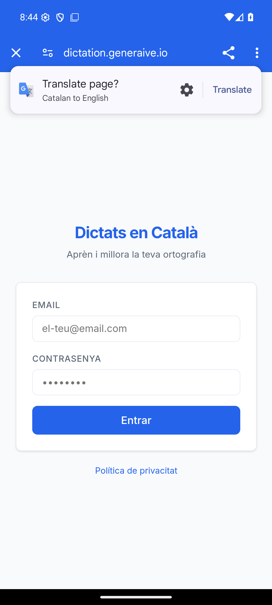
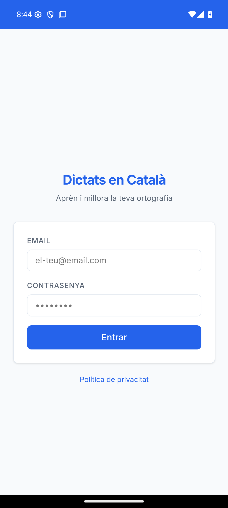

# L'AAB: construir-lo, signar-lo i provar-lo

Fase 2 del gameplan · Issue [#18](https://github.com/CronosAIDev/wiki-cronos/issues/18)

> **Es pot fer TOT això sense esperar cap decisió.** L'`applicationId` es congela al **pujar**
> el primer AAB, no al construir-lo. Aquí s'ha fet servir la proposta `io.generaive.dictats`;
> si l'Óscar en tria un altre, es canvia una línia del `twa-manifest.json` i es torna a
> construir. El keystore no hi té res a veure: no lliga amb cap identificador.

## El resultat, comprovat el 07-09-2026

| | |
|---|---|
| AAB | `~/dictats-twa/app-release-bundle.aab` · 1,2 MB |
| APK (per provar) | `~/dictats-twa/app-release-signed.apk` · 1,1 MB |
| `applicationId` | `io.generaive.dictats` (**provisional**) |
| Versió | `versionName 1.3.0`, `versionCode 1` |
| SDK | `minSdk 21`, `targetSdk 36` |
| Signat amb | el keystore de pujada — veure [`KEYSTORE.md`](KEYSTORE.md) |

L'empremta del certificat que va sortir de l'APK construït:

```
SHA-256: 79ce508291f54b677677d8ea8f8b3d951313c05c664afaf6e0d1990b54f828bc
```

que és **exactament** la que hi ha documentada al `KEYSTORE.md`. Es comprova així:

```bash
~/Android/Sdk/build-tools/36.1.0/apksigner verify --print-certs ~/dictats-twa/app-release-signed.apk
```

## Com es refà

El projecte viu a `~/dictats-twa`, **fora del repo**, com el keystore: conté rutes locals i
un `node_modules` de 281 paquets que no pinta res aquí. El que sí que és del repo és el
[`twa-manifest.json`](twa-manifest.json) — la definició del build, que és el que cal per
tornar-lo a fer igual.

```bash
cd ~/dictats-twa
cp <repo>/docs/sections/publicacio/twa-manifest.json .
./node_modules/.bin/bubblewrap update --skipVersionUpgrade
export BUBBLEWRAP_KEYSTORE_PASSWORD='…'      # del gestor de contrasenyes
export BUBBLEWRAP_KEY_PASSWORD="$BUBBLEWRAP_KEYSTORE_PASSWORD"
./node_modules/.bin/bubblewrap build --skipPwaValidation
```

## Les quatre pedres del camí, per no tornar-hi a picar

**1. `bubblewrap update` es penja sense dir res.** Si `appVersion` no és igual que
`appVersionCode`, demana per teclat una versió nova; sense terminal interactiva es queda
esperant per sempre, sense imprimir ni una lletra. **`--skipVersionUpgrade`** i ja.

**2. «The provided androidSdk isn't correct».** Bubblewrap comprova que existeixi
`<sdk>/tools` o `<sdk>/bin`, que és el repartiment vell del SDK. Un SDK modern té les eines
a `cmdline-tools/latest`. Es resol amb un enllaç:

```bash
ln -sfn ~/Android/Sdk/cmdline-tools/latest ~/Android/Sdk/tools
```

**`tools`, no `bin`.** Amb `bin` la validació passa però el `sdkmanager` peta amb
`ClassNotFoundException`: l'script busca les seves llibreries a `../lib` relatiu a on és, i
`<sdk>/lib` no existeix. Amb `tools` apunta a `cmdline-tools/latest/lib`, que sí.

**3. Vol una versió concreta de build-tools.** Bubblewrap 1.25 demana **36.1.0** i cap
altra; amb la 34 instal·lada se la torna a voler baixar ell sol i falla. `sdkmanager
"build-tools;36.1.0"`.

**4. ⚠️ Si la contrasenya és dolenta, `apksigner` l'escriu sencera al missatge d'error.**
No la tapa. Qualsevol log, captura o historial de terminal on hagi fallat una signatura
conté la contrasenya en clar. És un motiu més perquè visqui en un gestor i no en un fitxer
de text al costat de la clau.

## Provat en un Android de veritat (emulador)

L'AVD `dictats` (Android 16, x86_64, `google_apis`) ja existia a la màquina.

```bash
~/Android/Sdk/emulator/emulator -avd dictats -no-window -gpu swiftshader_indirect
adb install -r ~/dictats-twa/app-release-signed.apk
adb shell monkey -p io.generaive.dictats -c android.intent.category.LAUNCHER 1
```

L'app **s'obre, connecta amb producció i pinta el login** — el `start_url` és `/mobile` i el
servidor redirigeix a `/login` perquè no hi ha sessió, que és el que ha de passar.

### I la trampa 2, vista en comptes de suposada



Surt **amb la barra de Chrome a sobre i sense cap error enlloc**, exactament el que avisa
l'[`ASSETLINKS.md`](ASSETLINKS.md): avui `assetlinks.json` té la llista buida, la
verificació de Digital Asset Links falla i el TWA cau a Custom Tabs. Ningú et diu res.

Per comprovar que **és l'única cosa que falta** —i no un problema d'`scope`, de host o del
manifest— es desactiva la verificació només en aquest emulador:

```bash
adb root
adb shell "echo 'chrome --disable-digital-asset-link-verification-for-url=https://dictation.generaive.io' \
  > /data/local/tmp/chrome-command-line"
adb shell am set-debug-app --persistent com.android.chrome
```



Pantalla sencera, sense barra, i la barra d'estat del color del tema. **La resta del TWA és
correcta**; el que queda és el fitxer.

## Què falta, i de qui depèn

- [ ] **L'`applicationId` definitiu** — decisió de l'Óscar ([#18](https://github.com/CronosAIDev/wiki-cronos/issues/18), [#20](https://github.com/CronosAIDev/wiki-cronos/issues/20)). Canviar-lo és una línia i tornar a construir.
- [ ] **Pujar el primer AAB** a Play Console, que és el que congela l'`applicationId` i el que fa existir la segona empremta.
- [ ] **Escriure l'`assetlinks.json` de debò** amb les dues empremtes i desplegar-lo.
- [ ] **Un dictat sencer dins del TWA.** Fa falta un compte de producció, que aquí no hi ha. L'APK és a `~/dictats-twa/app-release-signed.apk` i s'instal·la en qualsevol Android amb `adb install`.

## Sense verificar

- **La síntesi de veu dins del TWA.** L'emulador no porta cap veu catalana, així que el que
  es veuria és l'avís de F21, no el dictat. S'ha de provar en un mòbil amb la veu posada.
- **La càmera per al mode paper.** El TWA la demana a través de Chrome; no s'ha provat.


---

## La trampa 2, vista abans de pujar res (08-09-2026)

Aquest document deia —i el gameplan també— que `assetlinks.json` necessita **dues**
empremtes i que la segona **només existeix després de pujar el primer AAB**. És cert, i per
això semblava que no es podia comprovar res fins llavors.

**Es podia.** L'APK que construïm i instal·lem nosaltres va signat amb la **nostra** clau de
pujada, no amb la de Google: aquella empremta ja la tenim des del dia que es va crear el
keystore. Amb ella sola al fitxer, l'app que construïm verifica.

Fet i **vist**, no suposat:

```
$ apksigner verify --print-certs app-release-signed.apk
Signer #1 certificate SHA-256 digest: 79ce5082…54f828bc     ← la mateixa que a assetlinks
```

L'app s'obre **a pantalla completa, sense la barra de Chrome**, i des de dins s'ha pogut fer
una alta de compte sencera contra Firebase.

`scripts/assetlinks.js --previ <empremta>` escriu aquest fitxer. Segueix negant-se a
escriure'n un amb una sola empremta **sense** el flag: el guardarail hi és per evitar un
descuit, no una decisió a consciència.

⚠️ **El fitxer que en surt NO serveix per a l'app publicada.** Quan Google torni a signar
l'app hi haurà una segona empremta, i sense afegir-la l'app de Play sortirà amb la barra i
sense donar cap error — que és la trampa original, intacta.

### El que encara no s'ha provat

Un **mòbil físic**. L'emulador fa la mateixa comprovació d'`assetlinks` i el mateix
contenidor, però no diu res del micròfon, de la síntesi de veu en català ni de la càmera
per a la foto — que és justament el que més falla en un aparell de veritat.
